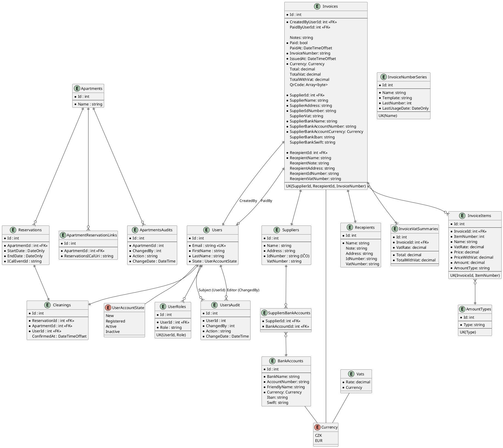

# Databáze

Pro správu DB je použit EF Core.

DB provider je PostgreSQL.

## DB Schéma

(schéma entit, EF Core má ve správě celou DB)

DB schémata:

* `broomsvc`:
      * Users
      * UserRoles
      * UsersAudit
* `broomsvc_apartments`
      * Apartments
      * Reservations
      * ApartmentReservationLinks
      * Cleanings
      * ApartmentsAudits
* `broomsvc_invoices`
      * Suppliers
      * BankAccounts
      * Currency
      * SuppliersBankAccounts
      * Invoices
      * Recepients
      * Vats
      * InvoiceVatSummaries
      * InvoiceItems
      * AmountTypes
      * InvoiceNumberSeries
      
