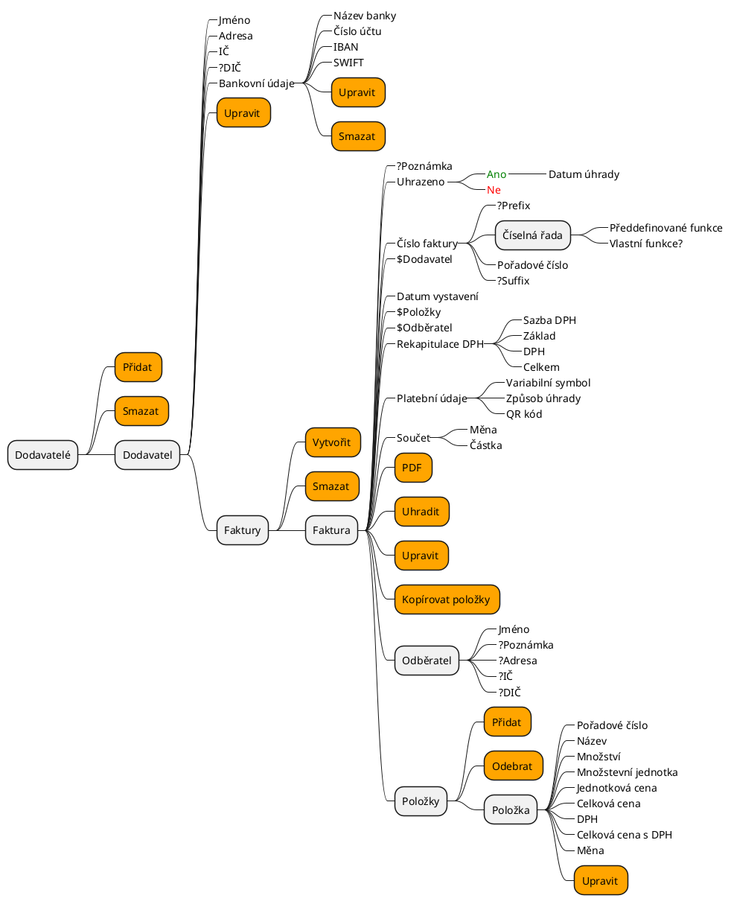

# Správa faktur

## Mindmapa faktur

```puml
@startmindmap

<style>
  .green {
    FontColor green
  }
  .red {
    FontColor red
  }
  .action {
    FontColor #010101;
    BackgroundColor Orange;
  }
</style>
* Dodavatelé
    * Přidat <<action>>
    * Smazat <<action>>
    * Dodavatel
        *_ Jméno
        *_ Adresa
        *_ IČ
        *_ ?DIČ
        *_ Bankovní údaje
            *_ Název banky
            *_ Číslo účtu
            *_ IBAN
            *_ SWIFT
            * Upravit <<action>>
            * Smazat <<action>>
        * Upravit <<action>>
    
        * Faktury
            * Vytvořit <<action>>
            * Smazat <<action>>
    
            * Faktura
                *_ ?Poznámka
                *_ Uhrazeno 
                    *_ Ano <<green>>
                        *_ Datum úhrady
                    *_ Ne <<red>>
                *_ Číslo faktury
                    *_ ?Prefix
                    * Číselná řada
                        *_ Předdefinované funkce
                        *_ Vlastní funkce?
                    *_ Pořadové číslo
                    *_ ?Suffix
                *_ $Dodavatel
                *_ Datum vystavení
                *_ $Položky
                *_ $Odběratel
                *_ Rekapitulace DPH
                    *_ Sazba DPH
                    *_ Základ
                    *_ DPH
                    *_ Celkem
                *_ Platební údaje
                    *_ Variabilní symbol
                    *_ Způsob úhrady
                    *_ QR kód
                *_ Součet
                    *_ Měna
                    *_ Částka
                * PDF <<action>>
                * Uhradit <<action>>
                * Upravit <<action>>
                * Kopírovat položky <<action>>
    
                * Odběratel
                    *_ Jméno
                    *_ ?Poznámka
                    *_ ?Adresa
                    *_ ?IČ
                    *_ ?DIČ
                * Položky
                    * Přidat <<action>>
                    * Odebrat <<action>>
                    * Položka
                        *_ Pořadové číslo
                        *_ Název
                        *_ Množství
                        *_ Množstevní jednotka
                        *_ Jednotková cena
                        *_ Celková cena
                        *_ DPH
                        *_ Celková cena s DPH
                        *_ Měna
                        * Upravit <<action>>

@endmindmap
```